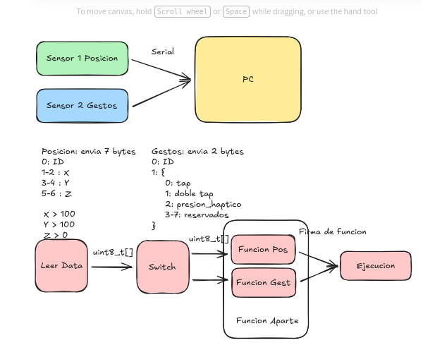

# EP5801---1611339

Repositoria para incluir todas las asignaciones dadas en la materia EP5801.

+ Asignación III: Implementación de bitfields y estructuras, simulando la entrada simple de un micro y siguiendo la estructura del siguiente diagrama:
  
  
